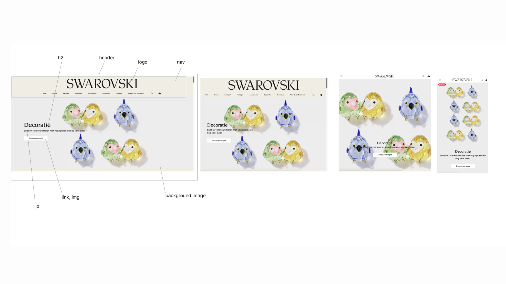

# Procesverslag
Markdown is een simpele manier om HTML te schrijven.  
Markdown cheat cheet: [Hulp bij het schrijven van Markdown](https://github.com/adam-p/markdown-here/wiki/Markdown-Cheatsheet).

Nb. De standaardstructuur en de spartaanse opmaak van de README.md zijn helemaal prima. Het gaat om de inhoud van je procesverslag. Besteedt de tijd voor pracht en praal aan je website.

Nb. Door *open* toe te voegen aan een *details* element kun je deze standaard open zetten. Fijn om dat steeds voor de relevante stuk(ken) te doen.

## Jij

  
uitwerken voor kick-off werkgroep

  ### Auteur:
  Kim van Zuilen

  #### Je startniveau:
  rood

  #### Je focus:
  Responsive
 

## Je website

  
uitwerken voor kick-off werkgroep

  ### Je opdracht:
    https://www.swarovski.com/nl-NL/ , Ik ga de overzichtspagina en de decoratie pagina van Swarovski namaken

  #### Screenshot(s) van de eerste pagina (small screen): 
 Overzichtspagina (link naar het bord waar alle foto's op staan)
 https://miro.com/app/board/uXjVN26wGAQ=/?share_link_id=674658767710

  #### Screenshot(s) van de tweede pagina (small screen):
  Decoratie pagina
 https://miro.com/app/board/uXjVN26wGAQ=/?share_link_id=674658767710
 

## Herkansing + Feedback

  
Herkansing website 

    ### herkansing
    Voor mijn herkansing ben ik helemaal opnieuw begonnen. Ik had namelijk mijn website gekozen in de tijd dat kerst zou gaan komen, waardoor de styling van mijn website hierdoor was aangepast. Ook had ik een samenwerking uitgekozen van Skims die aan het eind van het vak ook niet meer liep.
    
    Hierdoor heb ik ervoor gekozen om uiteindelijk mijn aandacht te schenken aan een ander vak en met een schone lei te beginnen aan de herkansing. Voor deze herkansing heb ik 2 pagina's gekozen die van styling en functies hetzelfde zijn als de vorige. 
    
    Reden voor het veranderen van keuze tussen de planes. Ik kwam er snel achter dat ik eigenlijk onbewust al bezig was met het maken een responsive website. Maar omdat ik in het begin een surface plan website heb ik gekozen, was ik erg veel tijd kwijt aan het toevoegen van elementen. Voor deze herkansing heb ik er dus voor gekozen om nu de responsive (kant) te kiezen. 
    

## Toegankelijkheidstest 1/2 (week 1)

  
uitwerken na test in 2e werkgroep

  ### Bevindingen Vóór de herkansing
  
  
    
  Lijst met je bevindingen die in de test naar voren kwamen:
  - Veel foto's worden niet benoemd als foto's maar als links, zie voorbeeld; 
  - Soms worden er andere kopjes door elkaar gehaald met de H2 en H3
  - Bij foto's worden er geen beschrijvingen gezet. De foto's worden ook niet gezien als foto's maar als links.
  - Sommige stukken tekst worden niet beschreven als paragrafen,p, maar als #text
  
  

    ### Bevindingen herkansing
    Voor mijn herkansing gebruik ik dezelfde website alleen verschillende slides van de website. Aangezien de thema's zijn veranderd. Ondanks ik ben verandert van pagina's komen de bevindingen van de toegankelijkheidstest wel overeen omdat de fouten die zij maken voor het opstellen van de website overal hetzelfde zijn. Dus zijn de bevindingen nog steeds geldig.

## Breakdownschets (week 1)

  
uitwerken na afloop 3e werkgroep

  
    
      
        
          
            
              
                
                  
                  
                    
                      
                        
                          
                            
                              
                                

## Voortgang 1 (week 2)

  
uitwerken voor 1e voortgang

  
### Herkansing vooruitgang
    Als eerst ben ik goed gaan kijken naar mijn website en ik kwam er al snel achter dat het een beter besluit zou zijn om helemaal opnieuw te beginnen. Er waren namelijk een paar dingen die echt beter hadden gekund.
    
    - informatie beter verzamelen 
    - foto's beter benoemen
    - meer informatie zoeken over hoe je bepaalde code moet schrijven inplaats van proberen
    
### Vooruitgang week 1 
Ik ben dit project begonnen met een cursus volgen online voor responsive design. Ik ben niet ervaren met coderen dus vond ik dit handig om te doen. Ik heb dit gedaan op de website Codecademy. Nadat ik de cursus heb afgerond, ben ik begonnen met de website. Ik heb eerst alle Html code geschreven van beide pagina's. Daarna ben ik de css gaan schrijven voor de allergrootste grootte van de pagina's. 

  ### Stand van zaken
  Hier dit ging goed & dit was lastig (neem ook screenshots op van delen van je website en code)
   
  Ik heb gemerkt bij het maken van de oefeningen in les dat ik grid nog wel lastig vindt. Ook vind ik het lastig om te beslissen wanneer je een div, een class of een span nodig hebt, aangezien de code van de website van Swarovski alleen maar daar uit bestaat. Dus voor nu heb ik alle content erin gezet en een paar div met span (alleen voor bepaalde artikelen). 
  Veel foto's waren links, dus deze heb ik ook in de code gezet. Ik liep wel  tegen 1 ding aan > Als je een foto download van de website komt het als een .avif bestand eruit en die wordt niet herkend dus ik heb alle foto's als png moeten omzetten. Ook had ik eerst alle foto's in 1 de map images, maar nu heb ik die wel opgedeeld in verschillende onderwerpen: 
  - kim-kardashain
  - ornaments
  - sieraden
  - kleding 
  - overige foto's

  
  ### 24 november - Eerste feedback 
  1) Breakdown : Niet alle elementen zijn uitgebreid beschreven. Dit houdt in ;
  - in de header staan icoontjes van een winkelmandje > deze heb ik alleen aangegeven als een icoon, maar het is een button  met een image. 
  Ook had ik in mijn vorige breakdown geen articles of sections genoemd, dus dit moet ook nog gedaan worden. 
  
  2) De html code : Zoals hierboven vermeld, had ik nog geen gebruik gemaakt van articles of sections dus deze moet ik erin zetten. Ook het gebruik van 
  de headings moeten aangepast worden > Let op H2 & H3.
  Bij de beschrijvingen van kleding > 30% korting, 3 kleuren > had ik gebruik gemaakt van spans, maar ik kan hiervoor ook p gebruiken. 
  

## Voortgang 2 (week 3)

  
uitwerken voor 2e voortgang

 ### Stand van zaken (herkansing)
 ### Vooruitgang week 2
In week 2 heb ik de css afgemaakt en ben ik mij gaan richten op het responsive maken. Dit was toch iets lastiger dan gedacht, aangezien bij de cursus je 1 onderdeel had dat je moest stylen, maar dat is in de werkelijkheid anders. Ik heb hier veel mee lopen experimenteren en oefenen en uiteindelijk is het mij gelukt om het repsonsive te maken. 

1 ding waar ik tegen aanliep bij het schrijven van de code waren de grootte van de images. Alle foto's van swarovski staan in een avif bestand. Een avif bestand is een andere methode om foto's en video's op te slaan. Deze methode zorgt voor een goede kwaliteit, maar ik wist niet of ik dit kon gebruiken. 

Wel ben ik erg trots op hoe ik dit proces heb aangepakt. Het was geen makkelijke route die ik heb genomen voor dit vak, maar ben zeker gegroeid in het proces en durf wel te zeggen dat ik trots ben op mijn werk. Ik had namelijk nooit gedacht dat ik zoiets kon gaan maken in jaar 2!!! :)

  ### Stand van zaken (voor herkansing)
  Deze week was voor mij geen goede week. Het coderen met Css ging niet bepaald goed.
  Na de feedback van week 1 was ik er van overtuigd dat alles wel ging lukken alleen nadat ik de Html code allemaal had opgeschreven, liep ik tegen een muur aan. 
  Niet omdat de code fout was, maar omdat ik het allemaal zo was. Waar moest ik beginnen?  Ik ben toen begonnen met de inhoud van de website, maar ik kwam er al snel achter dat dit niet ging. 
  Ook moest al mijn kennis weer opgefrist worden wat mij veel tijd heeft gekost. 
  

  ### Belangrijke ontdekkingen deze week
  Wat ik uiteindelijk deze week heb gedaan is:
  - navigatiebar gemaakt 
  - foto's allemaal opgeslagen in png bestand + juiste formaat (bijna allemaal)
  - feedback verwerkt van vorige week
  - juiste vervanging gevonden voor de font-family

## Toegankelijkheidstest 2/2 (week 4)

  
uitwerken na test in 9e werkgroep

  ### Bevindingen
  Lijst met je bevindingen die in de test naar voren kwamen (geef ook aan wat er verbeterd is):

## Voortgang 3 (week 4)

  
uitwerken voor 3e voortgang

  ### Stand van zaken
  Ik liep aan het einde tegen heel wat dingen aan:
  1) Ik heb bepaalde secties met daarin artikelen, maar voor de responsive deisgn worden deze artikelen kleiner naarmate je het scherm kleiner maakt. Voor de derde grootte van het scherm verandert de grote van het responsive design niet meer. Ik weet ook niet hoe ik dit moet oplossen.
  2) Ik had erg veel moeite met tekst over een video heenkrijgen. Dit is mij uiteindelijk gelukt toen ik gebruik ging maken van z-index. Met z-index kun je de items naar voren selecteren of naar achteren. Ik heb dit op deze manier opgelost.
  3) Video van marvel bij disney op de decoratie pagina was heel lastig om goed te plaatsen in de website. Het filmpje is erg groot en niet goed geschaald. Hierdoor is het een uitdaging om de width 100% te maken maar dat de hoogte niet ook 100% is. Ik heb hier veel mee lopen struggelen en uiteindelijk is het mij gelukt om in de video tag > controls height , neer te zetten. Wel is daardoor een deel van de video ingezoomed. 
  4) De footer verandert als het scherm kleiner wordt. Dit moet ik nog gaan oplossen 

## Eindgesprek (week 5)

  
uitwerken voor eindgesprek

  ### Je uitkomst - karakteristiek screenshots:
  

  ### Dit ging goed/Heb ik geleerd: 
  Korte omschrijving met plaatjes

  

  ### Dit was lastig/Is niet gelukt:
  Korte omschrijving met plaatjes

  

## Bronnenlijst

  
continu bijhouden terwijl je werkt

  Nb. Wees specifiek ('css-tricks' als bron is bijv. niet specifiek genoeg). 
  Nb. ChatGpT en andere AI horen er ook bij.
  Nb. Vermeld de bronnen ook in je code.

  1. bron 1
  2. bron 2
  3. ...

